# Project 1 - Finding the lane lines

## concepts learned:
* Region Masking
* Gaussian Blur
* Canny Edge detection
* Hough transform

## Action plan:
* Convert the image into HSL. Why HSL? When I tried with GRAY, I was not able to find lines in frames with different ligthings(Say, more light)
* Apply color masks to find out yellow and white lanes
* Convert the image to grayscale
* Smoothe the edges using Gaussian blur
* Find the edges using Canny edge detector
* Find lines using Hough transform
* Fit the points in a line and extrapolate the line
* Overlay the lane image on actual image


```python
#importing some useful packages
import matplotlib.pyplot as plt
import matplotlib.image as mpimg
import numpy as np
import cv2
%matplotlib inline
```


```python
image = mpimg.imread('test_images/solidWhiteRight.jpg')
#printing out some stats and plotting
print('This image is:', type(image), 'with dimensions:', image.shape)
plt.imshow(image) 
```

    This image is: <class 'numpy.ndarray'> with dimensions: (540, 960, 3)
    


    <matplotlib.image.AxesImage at 0x19285eead48>


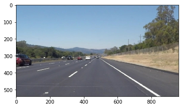


## Helper functions and their outputs
I have decided to add some functions and to modify some of functions given in the project and test their output.

Added functions are,
* `convert_to_HLS` - converts the image to HLS color space
* `filter_out_pixel` - filters pixel above the threshold and returns the filtered image
* `get_mask_quadrilateral` - returns verticies of a quadrilateral for masking
* `normalize_and_draw_lines` - returns line image after fitting the points on a line and extrapolating the lane line
* `resize_image` - resizes the image by given scale and returns it 
* `place_image_over` - Place given image on another image

Modified function is,
* `hough_lines` - now the function returns lines found through hough lines


```python
def convert_to_HLS(img):
    '''
    Takes a RGB image and returns the image by converting it to HLS
    '''
    return cv2.cvtColor(img, cv2.COLOR_RGB2HLS)
```


```python
hls_img = convert_to_HLS(image)
plt.imshow(hls_img)

```


    <matplotlib.image.AxesImage at 0x192868a2708>


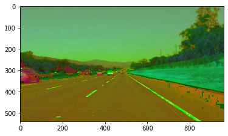


```python
for i in [0, 1, 2]:
    channel = hls_img[:,:,i]
    #plt.figure()
    plt.imshow(channel)
    plt.show()
```


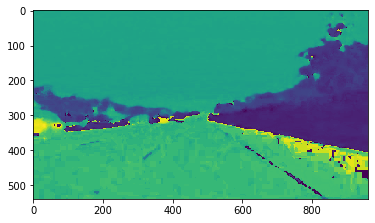


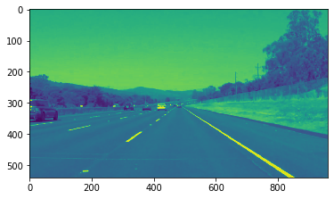


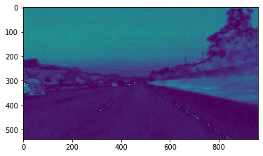


```python
def filter_out_pixel(img, threshold=[175, 175, 175]):
    '''
    Returns the img after selecting the pixels above threshold
    '''
    img = img.copy()
    thresholds = (img[:,:,0] > threshold[0]) | (img[:,:,1] > threshold[1]) | (img[:,:,2] > threshold[2])
    img[~thresholds] = [0, 0, 0]
    return img
    
```


```python
try_thresholds = [[175, 175, 175], [185, 185, 185], [190, 190, 190], [200, 200, 200]]
for threshold in try_thresholds:
    print("Output of color range with threshold", threshold)
    plt.imshow(filter_out_pixel(hls_img, threshold=threshold))
    plt.show()
```

    Output of color range with threshold [175, 175, 175]
    


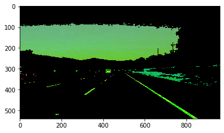


    Output of color range with threshold [185, 185, 185]
    


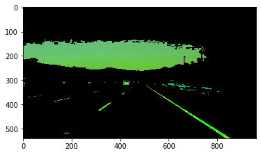


    Output of color range with threshold [190, 190, 190]
    


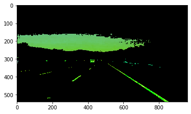


    Output of color range with threshold [200, 200, 200]
    


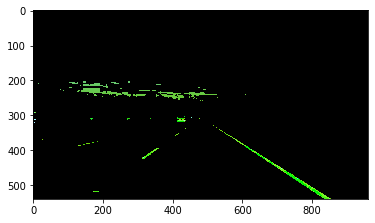


Threshold `[185, 185, 185]` yields good results, So I have decided to go with this threshold.


```python
def grayscale(img):
    '''
    Applies the Grayscale transform.
    '''
    return cv2.cvtColor(img, cv2.COLOR_RGB2GRAY)
```


```python
gray_img = grayscale(filter_out_pixel(hls_img, threshold=[185, 185, 185]))
plt.imshow(gray_img, cmap='gray')
```


    <matplotlib.image.AxesImage at 0x1928693a448>


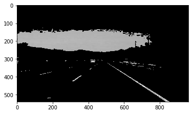


```python
def region_of_interest(img, vertices):
    """
    Applies an image mask.
    
    Only keeps the region of the image defined by the polygon
    formed from `vertices`. The rest of the image is set to black.
    """
    #defining a blank mask to start with
    mask = np.zeros_like(img)   
    
    #defining a 3 channel or 1 channel color to fill the mask with depending on the input image
    if len(img.shape) > 2:
        channel_count = img.shape[2]  # i.e. 3 or 4 depending on your image
        ignore_mask_color = (255,) * channel_count
    else:
        ignore_mask_color = 255
        
    #filling pixels inside the polygon defined by "vertices" with the fill color    
    cv2.fillPoly(mask, vertices, ignore_mask_color)
    
    #returning the image only where mask pixels are nonzero
    masked_image = cv2.bitwise_and(img, mask)
    return masked_image
```


```python
def get_mask_quadrilateral(img, xoffset=40, yoffset=50):
    '''
    returns verticies of a quadrilateral for masking
    '''
    ymax = img.shape[0]
    xmax = img.shape[1]
    left_bottom = [0, ymax-1]
    right_bottom = [xmax-1, ymax-1]
    right_top = [xmax//2+xoffset//2, ymax//2+yoffset]
    left_top = [xmax//2-xoffset//2, ymax//2+yoffset]
    return [np.array([left_bottom, left_top, right_top, right_bottom], np.int32)]
```

Let's apply region masking using `region_of_interest()`. I will be using an quadrilateral for masking and the quadrilateral is made by `get_mask_quadrilateral()`


```python
masked_img = region_of_interest(gray_img, get_mask_quadrilateral(gray_img, xoffset=40, yoffset=58))
plt.imshow(masked_img, cmap='gray')
```


    <matplotlib.image.AxesImage at 0x19286959908>


```python
def gaussian_blur(img, kernel_size):
    """Applies a Gaussian Noise kernel"""
    return cv2.GaussianBlur(img, (kernel_size, kernel_size), 0)
```


```python
kernel_sizes = [3, 5, 9]
for size in kernel_sizes:
    print("Image after gaussian blur with kernel size", size)
    blurred_img = gaussian_blur(masked_img, kernel_size=size)
    plt.imshow(blurred_img, cmap='gray')
    plt.show()
```

    Image after gaussian blur with kernel size 3
    


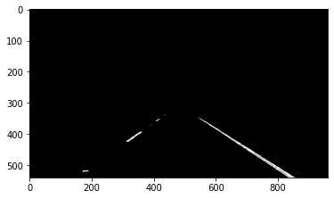


    Image after gaussian blur with kernel size 5
    


    Image after gaussian blur with kernel size 9
    


From this output, I have decided to use kernel size as 9 as it smoothes the lane lines much better than kernel size 5.


```python
def canny(img, low_threshold, high_threshold):
    """Applies the Canny transform"""
    return cv2.Canny(img, low_threshold, high_threshold)
```

Let's try canny edge detector to find the edges of the lane.


```python
try_canny = [[50, 90]]
for canny_threshold in try_canny:
    low, high = canny_threshold
    canny_img = canny(blurred_img, low_threshold=low, high_threshold=high)
    print("Image after applying canny edge dectector with low threshold -", low,"and high threshold -", high)
    print(canny_img.shape)
    plt.imshow(canny_img, cmap='gray')
    plt.show()
```

    Image after applying canny edge dectector with low threshold - 50 and high threshold - 90
    (540, 960)
    


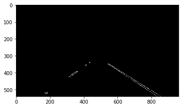


```python
def draw_lines(img, lines, color=[255, 0, 0], thickness=2):
    """
    Returns the line image for 
    """
    line_img = np.zeros((img.shape[0], img.shape[1], 3), dtype=np.uint8)
    for line in lines:
        for x1,y1,x2,y2 in line:
            cv2.line(line_img, (x1, y1), (x2, y2), color, thickness)
    return line_img

```


```python
def hough_lines(img, rho, theta, threshold, min_line_len, max_line_gap, verbose=False):
    """
    `img` should be the output of a Canny transform.
        
    Returns an list of lines after hough lines.
    """
    lines = cv2.HoughLinesP(img, rho, theta, threshold, np.array([]), minLineLength=min_line_len, maxLineGap=max_line_gap)
    if verbose:
        for line in lines:
            for x1,y1,x2,y2 in line:
                slope = (y2-y1) / (x2-x1)
            print(line, slope)
    return lines
```

Let's try to find lines using Hough transform,
* I minimized the min_line_len, so as to remove noise
* I maximized the max_line_gap to connect the different line segments


```python
lines = hough_lines(canny_img, rho=1, theta=np.pi/180, threshold=5, min_line_len=18, max_line_gap=100, verbose=True)
```

    [[546 347 852 538]] 0.6241830065359477
    [[540 348 831 537]] 0.6494845360824743
    [[555 356 655 421]] 0.65
    [[311 423 414 351]] -0.6990291262135923
    [[319 424 439 340]] -0.7
    [[768 497 832 539]] 0.65625
    [[315 425 438 339]] -0.6991869918699187
    [[311 424 438 338]] -0.6771653543307087
    [[312 424 350 396]] -0.7368421052631579
    [[561 360 609 392]] 0.6666666666666666
    [[322 423 418 354]] -0.71875
    [[629 405 789 505]] 0.625
    [[345 400 436 337]] -0.6923076923076923
    [[623 401 650 418]] 0.6296296296296297
    [[317 425 433 341]] -0.7241379310344828
    [[417 351 437 337]] -0.7
    [[554 351 584 369]] 0.6
    [[773 500 815 527]] 0.6428571428571429
    [[687 434 724 468]] 0.918918918918919
    [[680 438 729 460]] 0.4489795918367347
    [[547 348 840 531]] 0.6245733788395904
    

I thought I can group lines using the slope, positive slope means right lane and negative slope means left lane.

But when I looked into the slope of the lines, I saw that both right and left lane lines have positive and negative slopes.
So, I decided to group the lines by using the mid point in region of interest. The lines that fall left to the mid point are left lane lines and right to the mid point are considered as right lane lines.

Condition for left lane  - `x1 < xmid and x2 < xmid`
Condition for right lane - `x1 > xmid and x2 > xmid`

Then, I fitted a line using `polyfit` on left lane points and right lane points to get left lane and right lane, respectively.

Below, is the funciton.


```python
def normalize_and_draw_lines(img, lines, color=[255, 0, 0], thickness=2, verbose=False):
    """
    returns the line image for the img
    """
    line_img = np.zeros((img.shape[0], img.shape[1], 3), dtype=np.uint8)
    ymid = line_img.shape[0]//2
    xmid = line_img.shape[1]//2
    xleft, yleft, xright, yright= [], [], [], []
    for line in lines:
        for x1,y1,x2,y2 in line:
            if x1 < xmid and x2 < xmid:
                xleft.extend([x1, x2])
                yleft.extend([y1, y2])
                continue
            if x1 > xmid and x2 > xmid:
                xright.extend([x1, x2])
                yright.extend([y1, y2])
                continue

    rline, rerror, _, _, _ = np.polyfit(xright, yright, 1, full=True)
    lline, lerror, _, _, _ = np.polyfit(xleft, yleft, 1, full=True)
    
    if verbose:
        print("Number of lines", len(lines))
        print("right lane :",rline,rerror)
        print("left lane :",lline,lerror)
    '''
    right_top = [xmax//2+xoffset//2, ymax//2+yoffset]
    left_top = [xmax//2-xoffset//2, ymax//2+yoffset]
    '''
    xmax = line_img.shape[1]
    xoffset = 40
    #draw left lane line
    # xend = np.amax(xleft)
    xend = xmax//2-xoffset//2 #till the end of the roi
    cv2.line(line_img, (0, int(lline[1])), (xend, int(lline[0]*xend + lline[1])), color, thickness)
    #draw right lane line
    # xstart = np.amin(xright)
    xstart = xmax//2+xoffset//2 # start at the end of the roi
    xend = line_img.shape[1]
    cv2.line(line_img, (xstart, int(rline[0]*xstart + rline[1])), (xend, int(rline[0]*xend + rline[1])), color, thickness)
    return line_img

```


```python
line_img = normalize_and_draw_lines(canny_img, lines, color=[255, 0, 0], thickness=10, verbose=False)
plt.imshow(line_img)
```


    <matplotlib.image.AxesImage at 0x19286fe4908>


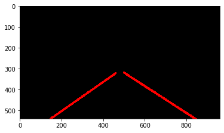


```python

import math
# Python 3 has support for cool math symbols.
def weighted_img(img, initial_img, α=0.8, β=1., γ=0.):
    """
    `img` is the output of the hough_lines(), An image with lines drawn on it.
    Should be a blank image (all black) with lines drawn on it.
    
    `initial_img` should be the image before any processing.
    
    The result image is computed as follows:
    
    initial_img * α + img * β + γ
    NOTE: initial_img and img must be the same shape!
    """
    return cv2.addWeighted(initial_img, α, img, β, γ)
```


```python
plt.imshow(weighted_img(line_img, image))
```


    <matplotlib.image.AxesImage at 0x192871dcfc8>


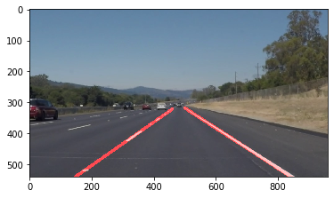


```python
def resize_image(img, scale=2):
    '''
    resizes the image by given scale and returns it 
    '''
    return cv2.resize(img, (img.shape[1]//scale, img.shape[0]//scale), interpolation = cv2.INTER_AREA)
```


```python
resized_img = resize_image(image, scale=4)
plt.imshow(resized_img)
```


    <matplotlib.image.AxesImage at 0x192871be988>


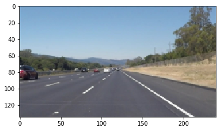


```python
def place_image_over(destination, source, x_offset=10, y_offset=10):
    '''
    Place given image on another image
    '''
    img = destination.copy()
    if len(source.shape) <= 2:
        img[y_offset:y_offset+source.shape[0], x_offset:x_offset+source.shape[1], 0] = source
        img[y_offset:y_offset+source.shape[0], x_offset:x_offset+source.shape[1], 1] = source
        img[y_offset:y_offset+source.shape[0], x_offset:x_offset+source.shape[1], 2] = source
    else:
        img[y_offset:y_offset+source.shape[0], x_offset:x_offset+source.shape[1]] = source
    return img
```


```python
plt.imshow(place_image_over(image, resized_img, x_offset=10, y_offset=10))
```


    <matplotlib.image.AxesImage at 0x19286e86748>


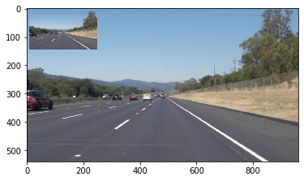


## Building the pipeline:
Below is the pipeline process defined as `pipeline`

* Convert the image into HSL.
* Apply color masks to find out yellow and white lanes
* Convert the image to grayscale
* Smoothe the edges using Gaussian blur
* Find the edges using Canny edge detector
* Find lines using Hough transform
* Fit the points in a line and extrapolate the line
* Overlay the lane image on actual image


```python
def pipeline(img):
    '''
    Accepts an image as img and returns an image with lane lines drawn on it. 
    '''
    hls_img = convert_to_HLS(img)
    gray_img = grayscale(filter_out_pixel(hls_img, threshold=[185, 185, 185]))
    masked_img = region_of_interest(gray_img, get_mask_quadrilateral(gray_img, xoffset=40, yoffset=58))
    blurred_img = gaussian_blur(masked_img, kernel_size=9)
    canny_img = canny(blurred_img, low_threshold=50, high_threshold=90)
    lines = hough_lines(canny_img, rho=1, theta=np.pi/180, threshold=5, min_line_len=18, max_line_gap=100, verbose=False)
    hough_ouput = draw_lines(canny_img, lines, color=[255, 0, 0], thickness=2)
    line_img = normalize_and_draw_lines(canny_img, lines, color=[255, 0, 0], thickness=10, verbose=False)
    overlayed_img = weighted_img(line_img, img)
    
    masked_img_resized = resize_image(masked_img, scale=4)
    canny_img_resized = resize_image(canny_img, scale=4)
    hough_img_resized = resize_image(hough_ouput, scale=4)
    overlayed_img = place_image_over(overlayed_img, masked_img_resized, x_offset=10, y_offset=10)
    overlayed_img = place_image_over(overlayed_img, canny_img_resized, x_offset=20+masked_img_resized.shape[1], y_offset=10)
    overlayed_img = place_image_over(overlayed_img, hough_img_resized, x_offset=30+2*masked_img_resized.shape[1], y_offset=10)
    return overlayed_img
```

## Test the pipeline with images

Below code tests the images from `test_images` folder and saves the output of the pipeline into `test_images_output` folder.


```python
import os
image_names = os.listdir('test_images/')
for image_name in image_names:
    image = mpimg.imread('test_images/' + image_name)
    output_img = pipeline(image)
    plt.imshow(output_img)
    plt.show()
    output_img = cv2.cvtColor(output_img, cv2.COLOR_RGB2BGR)
    cv2.imwrite('test_images_output/' + image_name, output_img)
```


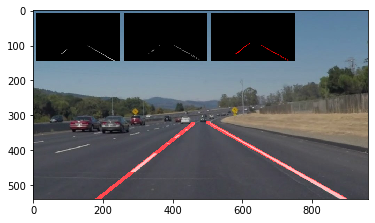


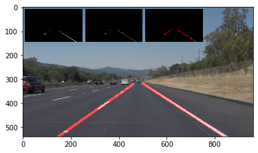


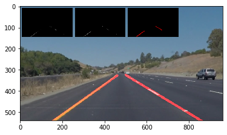


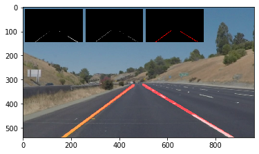


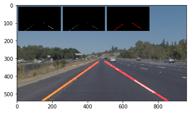


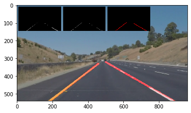


## Test pipeline with videos
Below code tests the pipeline for the videos in `test_videos` and stores the output in `test_videos_output`


```python
from moviepy.editor import VideoFileClip
from IPython.display import HTML
def process_image(image):
    # NOTE: The output you return should be a color image (3 channel) for processing video below
    # TODO: put your pipeline here,
    # you should return the final output (image where lines are drawn on lanes)
    result = pipeline(image)
    return result
```


```python
white_output = 'test_videos_output/solidWhiteRight.mp4'
clip1 = VideoFileClip("test_videos/solidWhiteRight.mp4")
white_clip = clip1.fl_image(process_image) #NOTE: this function expects color images!!
%time white_clip.write_videofile(white_output, audio=False)
```

    Moviepy - Building video test_videos_output/solidWhiteRight.mp4.
    Moviepy - Writing video test_videos_output/solidWhiteRight.mp4
    
    

                                                                                   

    Moviepy - Done !
    Moviepy - video ready test_videos_output/solidWhiteRight.mp4
    Wall time: 16.2 s
    


```python
HTML("""
<video width="960" height="540" controls>
  <source src="{0}">
</video>
""".format(white_output))
```


<video width="960" height="540" controls>
  <source src="test_videos_output/solidWhiteRight.mp4">
</video>


```python
yellow_output = 'test_videos_output/solidYellowLeft.mp4'
clip1 = VideoFileClip("test_videos/solidYellowLeft.mp4")
white_clip = clip1.fl_image(process_image) #NOTE: this function expects color images!!
%time white_clip.write_videofile(yellow_output, audio=False)
```

    Moviepy - Building video test_videos_output/solidYellowLeft.mp4.
    Moviepy - Writing video test_videos_output/solidYellowLeft.mp4
    
    

                                                                                   

    Moviepy - Done !
    Moviepy - video ready test_videos_output/solidYellowLeft.mp4
    Wall time: 43.8 s
    


```python
HTML("""
<video width="960" height="540" controls>
  <source src="{0}">
</video>
""".format(yellow_output))
```


<video width="960" height="540" controls>
  <source src="test_videos_output/solidYellowLeft.mp4">
</video>


```python
challenge_output = 'test_videos_output/challenge.mp4'
## To speed up the testing process you may want to try your pipeline on a shorter subclip of the video
## To do so add .subclip(start_second,end_second) to the end of the line below
## Where start_second and end_second are integer values representing the start and end of the subclip
## You may also uncomment the following line for a subclip of the first 5 seconds
##clip3 = VideoFileClip('test_videos/challenge.mp4').subclip(0,5)
clip3 = VideoFileClip('test_videos/challenge.mp4')
challenge_clip = clip3.fl_image(process_image)
%time challenge_clip.write_videofile(challenge_output, audio=False)
clip3.reader.close()
```

    Moviepy - Building video test_videos_output/challenge.mp4.
    Moviepy - Writing video test_videos_output/challenge.mp4
    
    

                                                                                   

    Moviepy - Done !
    Moviepy - video ready test_videos_output/challenge.mp4
    Wall time: 31.9 s
    


```python
HTML("""
<video width="960" height="540" controls>
  <source src="{0}">
</video>
""".format(challenge_output))
```


<video width="960" height="540" controls>
  <source src="test_videos_output/challenge.mp4">
</video>


## Areas to improve
* Curved lane lines cannot be detected with this approach. One method is to fit the points to a quadratic equation of degree 3 and plot the curve
* Some frames might be bad and we might not be able to detect the lanes. To overcome this we can store the lines from previous frames and plot for the bad frame.
