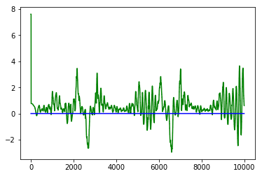

# PID Controller Project

### The effect each of the P, I, D components had in your implementation

#### Proportional error component (Kp) :
* Most observable effect.
* Steers car proportionally to the car's distance from the lane center (cte). ie, tries to steer car towards lane center.
* Overshoots the center line of lane easily.

#### Integral error component (Ki) :
* counters the bias in the system.
* Makes the car run in circles!
* From observations, I think there is no bias in simulator.

#### Differential error component (Kd) :
* Counter acts the `Kp`'s tendency to wiggle and makes the steer smooth.

### How the final hyperparameters were chosen?
For finding the parameters, I have used twiddle which is implemented in python. The jupyter notebook, `twiddle.ipynb` which connects to the term 2 simulator, runs car till best parameters are found. For each lap, cte vs number of frames is plotted. A lap is reset if average cte is too high or car is stuck or car runs out of the track. I had to run twiddle for around 2 hours to find the optimal parameters. The car was run with throttle 0.3 for 10000 frames. Below are the parameters found and corresponding plotted values of cte vs number of frames for that lap.

| Constant | Value |
|:-:|:-:|
| Kp  |  0.10899999999999971 |
| Ki |   0.0 |
| Kd |   2.638034613773101 |

### Output

Here is the recording of the run by using the above parameters in cpp implementation (code is in `src` folder).

 

    <video width="960" height="540" controls src="./files/pid_udacity.mp4" />

### Further improvements
While running for higher throttles above 40, wiggling becomes more visible.This wiggling can be reduced by fine tuning the `kd` (uping the value) and `kp`. Mannual tuning using [Ziegler Nichols method](http://kurser.iha.dk/m/mtpri1/control/3_PID/f_ziegler/ziegler_nichols_method.html) can be employed to get the hyper parameters.
